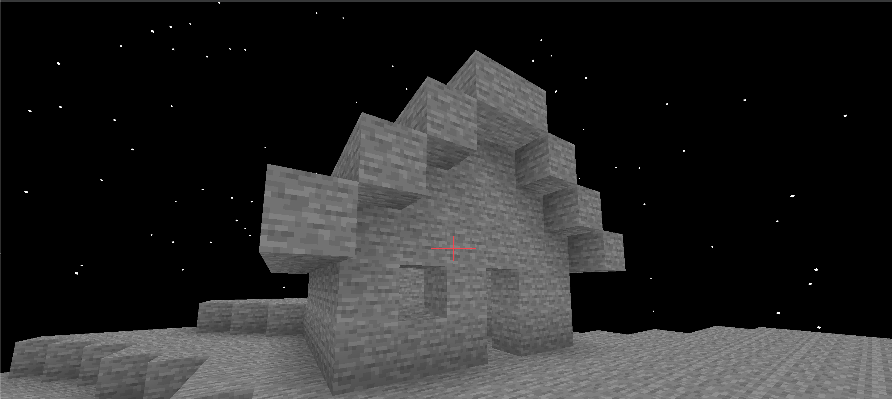

# Arc Engine

[English](README.md) | [Русский](README_ru.md)

Arc Engine is a flexible 3D/2D game engine designed to be implementation-agnostic, allowing it to work with virtually any technology and platform.

### Features
- Modern Kotlin API
- Implementation-agnostic architecture
- Ready-to-use OpenGL and Vulkan implementations
- Lightweight and simple - create games with minimal code and shader knowledge
- Multiple engine implementations in one game*
- Extensive extension system (Audio, Input, Display, Font, Model, Profiler)

\* Only one implementation can be used at runtime

Basic "cave-game" on this engine. (You can see code in `arc-demo`)


### Project Structure
- **arc-core**: Main engine API interfaces
- **arc-common**: Common implementation of core features (math, window, etc.)
- **arc-opengl**: OpenGL-based engine implementation
- **arc-vulkan**: Vulkan-based engine implementation
- **arc-extensions**: Various engine extensions
  - **arc-audio**: Audio system with OpenAL implementation
  - **arc-display**: Virtual displays system
  - **arc-font**: Font render system
  - **arc-input**: Input engine system with GLFW implementation
  - **arc-model**: LWAM models system
  - **arc-profiler**: Simple profiling system
- **arc-annotations**: Utility annotations for better API understanding
- **arc-annotation-processor**: Processor for annotations
- **arc-demo**: Demo applications and examples

### Requirements
- JDK 21 or higher
- Any lang for JVM (Kotlin is very recommended)
- OpenGL/Vulkan compatible graphics card

### Setup

1. Specify the Arc repository:
```kotlin
repositories {
    maven("https://maven.pkg.github.com/AxieFeat/Arc") {
        credentials {
            // GitHub Packages requires authentication :(

            username = System.getenv("GITHUB_ACTOR") // System environment variable with your GitHub login
            password = System.getenv("GITHUB_TOKEN") // System environment variable with your GitHub token
        }
    }
}
```

2. Add the dependency to your project:
```kotlin
dependencies {
    // Hash of commit can be taked from history - https://github.com/AxieFeat/Arc/commits/master/

    // If you want to use API in an already done game.
    implementation("arc.engine:arc-core:<first 7 symbols of commit hash>")


    // Or if you want to create your own game - select a backend implementation of engine.
    implementation("arc.engine:arc-opengl:<first 7 symbols of commit hash>") // For OpenGL
    implementation("arc.engine:arc-vulkan:<first 7 symbols of commit hash>") // For Vulkan
}
```

3. Add desired extensions:
```kotlin
dependencies {
    implementation("arc.engine:arc-input-glfw:<first 7 symbols of commit hash>") // For control's via GLFW.
    implementation("arc.engine:arc-audio-openal:<first 7 symbols of commit hash>") // For sound system.
    // Add other extensions as needed
}
```

### Basic Usage Example
Here's a simple example that renders a colored triangle:

```kotlin
// Note: Required imports from arc.* packages are omitted for brevity
// See the full example in arc-demo module

fun main() {
    // Bootstrap the implementations
    ArcFactoryProvider.install()
    ArcFactoryProvider.bootstrap()

    // Preload OpenGL
    OpenGL.preload()

    // Find application in current context (OpenGL implementation)
    val application: Application = Application.find()
    application.init()

    // Get shader and compile it
    val shader: ShaderInstance = getShaderInstance()
    shader.compileShaders()

    val renderSystem: RenderSystem = application.renderSystem

    // Create buffer with our vertices
    val buffer: VertexBuffer = createBuffer(application)

    while (!application.window.shouldClose()) {
        // Begin render frame
        renderSystem.beginFrame()

        shader.bind()
        renderSystem.drawer.draw(buffer)
        shader.unbind()

        // End frame
        renderSystem.endFrame()
    }
}

private fun getShaderInstance(): ShaderInstance {
    val vertexShader = """
        #version 410

        layout (location = 0) in vec3 Position;
        layout (location = 1) in vec4 Color;

        out vec4 vertexColor;

        void main()
        {
            gl_Position = vec4(Position, 1.0);

            vertexColor = Color;
        }
        """.trimIndent().asRuntimeAsset()

    val fragmentShader = """
        #version 410

        in vec4 vertexColor;
        out vec4 FragColor;

        void main()
        {
            FragColor = vertexColor;
        }
        """.trimIndent().asRuntimeAsset()

    return ShaderInstance.of(
        vertexShader,
        fragmentShader
    )
}

private fun createBuffer(application: Application): VertexBuffer {
    val buffer: DrawBuffer = application.renderSystem.drawer.begin(
        DrawerMode.TRIANGLES,
        VertexFormat.builder()
            .add(VertexFormatElement.POSITION)
            .add(VertexFormatElement.COLOR)
            .build()
    )

    buffer.addVertex(0f, 0.5f, 0f).setColor(Color.BLUE)
    buffer.addVertex(-0.5f, -0.5f, 0f).setColor(Color.RED)
    buffer.addVertex(0.5f, -0.5f, 0f).setColor(Color.GREEN)

    return buffer.build()
}
```

For more detailed examples, check the `arc-demo` module.

# Engine Philosophy

The engine does not imply direct use of LWJGL methods and internal implementations, for this reason all implementations
are **internal** classes. Users should use **only the functionality of `arc-core`** *(or other core modules)*. Using
internal implementations is highly undesirable, and dependencies like `arc.engine:arc-opengl` should
be specified only in the GAME, to initialize the OpenGL (in this case) context with a single line.

### Project Structure

(*Utility modules `arc-annotations` and `arc-annotation-processor` are excluded here*)

***arc-core*** - The main API of the engine, it consists of interfaces that are subsequently implemented by other
modules. It's important to understand that the API in this module should be generic and suitable for any rendering technology,
and you CANNOT use naming in this module that would refer to any specific implementation.

***arc-common*** - Basic implementation of arc-core, which contains functions common to all rendering technologies. For example, it
implements mathematics, window, and sound. If you create a class that is not abstract and serves only to
implement an interface from arc-core - make it `internal`. It is also not desirable to use naming
that would somehow refer to any specific implementation.

***arc-opengl*** - Engine implementation using OpenGL. In this module, it is desirable to write code
that will relate only to OpenGL. In this module, you should use naming
that refers to the fact that classes relate to OpenGL (For example, the prefix Gl at the beginning of class names). Also, if possible,
all classes should be `internal`.

***arc-vulkan*** - Engine implementation using Vulkan. In this module, it is desirable to write code
that will relate only to Vulkan. In this module, you should use naming
that refers to the fact that classes relate to Vulkan (For example, the prefix Vk at the beginning of class names). Also, if possible,
all classes should be `internal`.

***arc-extensions*** - Various extensions for the engine. If possible, it is necessary to divide extensions into a similar structure
as the engine itself. That is, a `core` module with description through interfaces, a `common` module with generalized implementations, and all other
modules (For example, `opengl`, `vulkan`, `openal`, `glfw`, etc.), which will be implemented through a specific technology.
